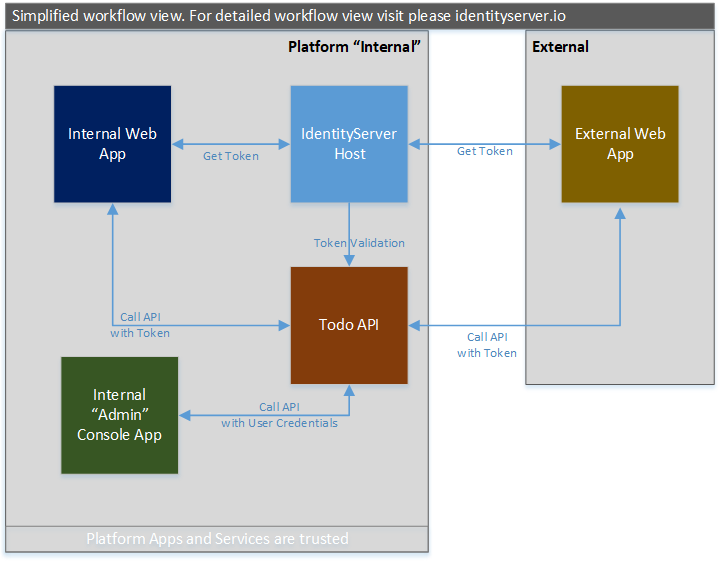
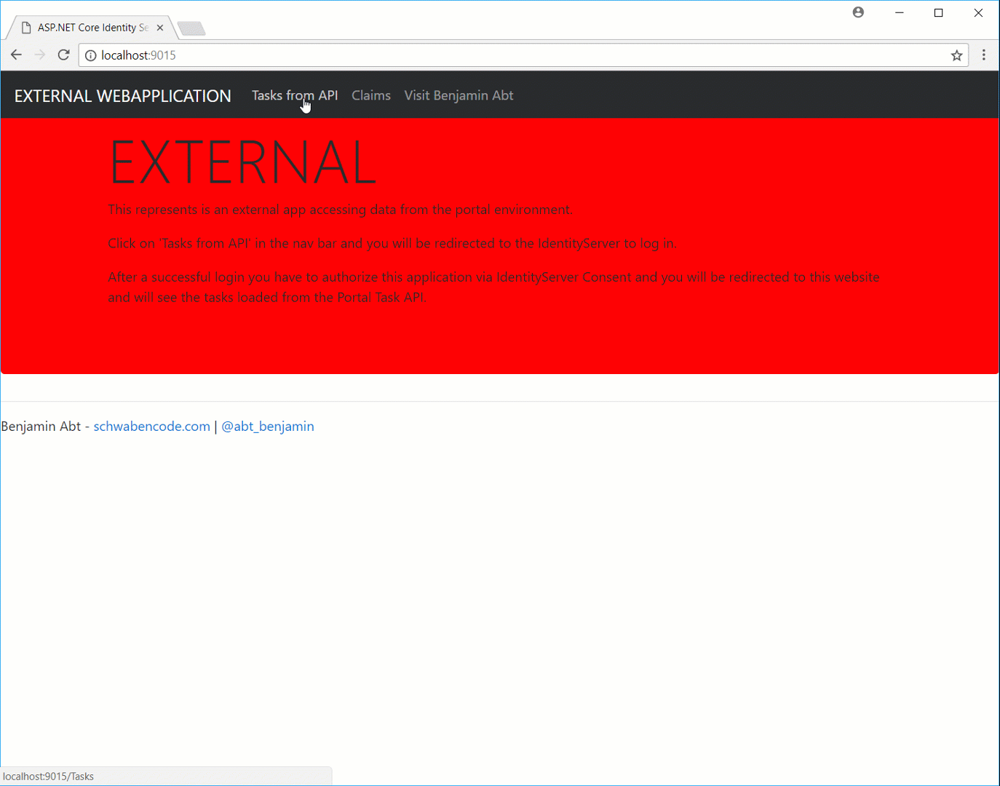
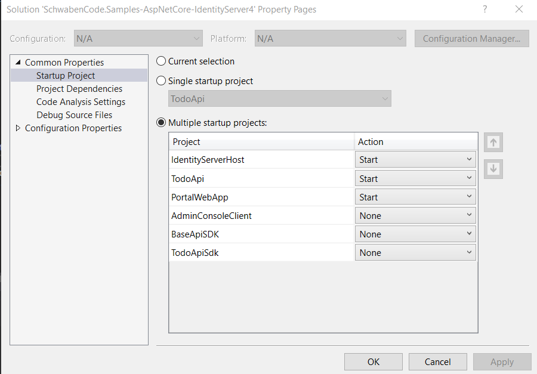
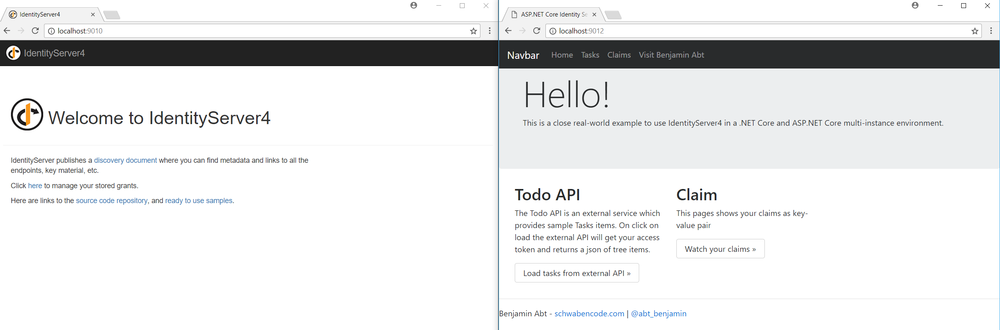
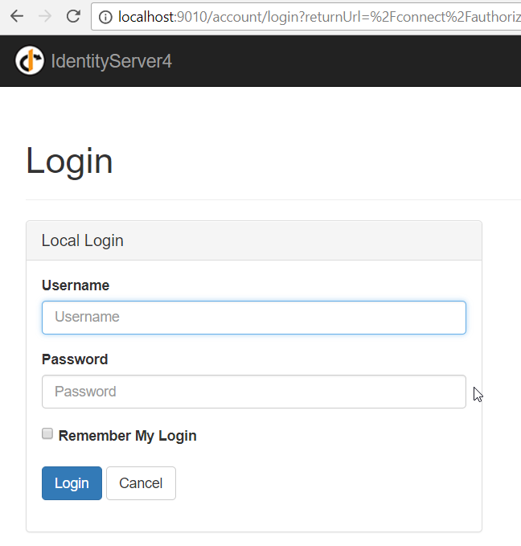
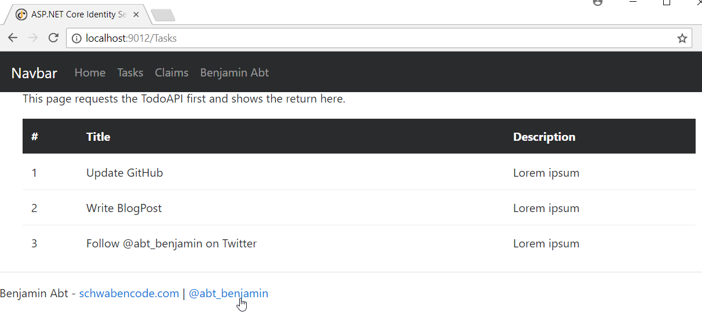
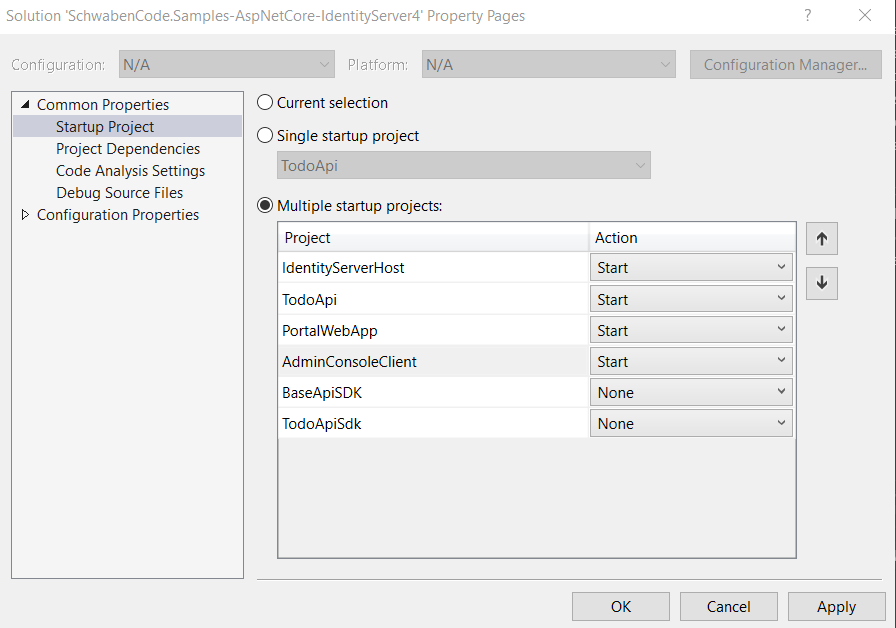
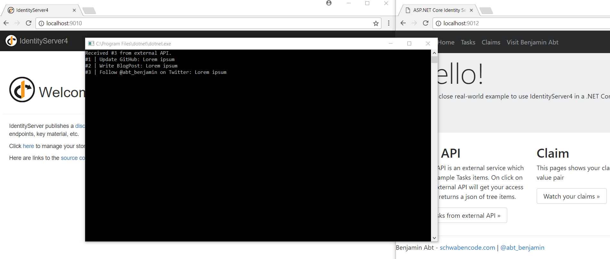

# Goal 

My goal was to build a sample with
- .NET Core 2.0 Console
- ASP.NET Core 2.0 Web App
- ASP.NET Core 2.0 Web API

Another goal was to show how the user workflow of application trust should be for "internal" platform services as well as for external clients.

## Donations

Please think twice and donate your money to useful institutions such as [children's hospices](http://www.bundesverband-kinderhospiz.de/spenden).

## Documentation

This sample shows the following workflow:



We have an internal area which represents our trusted application environment. Additionally, we see an external example application we do not develop or run.

## Consent

All our trusted "internal" applications can access all our APIs.
External applications have to be accepted by the user via [IdentityServer Consent](http://docs.identityserver.io/en/release/topics/consent.html)



## Projects

### IdentityServerHost

This ASP.NET Core 2.0 application hosts the IdentityServer.
All configurations like users, APIs and clients are static in the [SampleConfig.cs](src/Platform-IdentityServerHost/SampleConfig.cs) file.

The IdentityServer is registered inside of [Startup.cs](src/Platform-IdentityServerHost/Startup.cs)

The sources inside the [Quickstart](src/Platform-IdentityServerHost/Quickstart) are taken from https://github.com/IdentityServer/IdentityServer4.Quickstart.UI without modifications.

### BaseApiSDK

This projects provides basic stuff for accessing an API with the help of a SDK.
In a productive environment this would be a NuGet package.

### TodoApi

This ASP.NET Core 2.0 application hosts the demo API of todos.
All configurations like users, APIs and clients are static in the [ApiSampleOptions.cs](src/Platform-TasksApi/ApiSampleOptions.cs) file.

### TodoApiSdk

This projects provides a client `TodoApiClient` for accessing the TodoApi.
It gives you a client for authentication and receiving typed data.

In a productive environment this would be a NuGet package.

### PortalWebApp

This ASP.NET Core 2.0 application represents the "Portal Web Application" the user interacts with.

You have a navigation element to receive the tasks from the TodoApi with the help of the TodoApiSdk and you have a navigation element to watch your claims.

Both clicks will redirects you to the IdentityServerHost where you have to log in.
Afterwards to will be redirected to this application.

### ExternalWebApp

This ASP.NET Core 2.0 application represents an "External Web Application" which is not part of the platform and maybe run by an external company.

This application also provides a navigation element for tasks and claims but after the login the user has to accept the access for this application via via [IdentityServer Consent](http://docs.identityserver.io/en/release/topics/consent.html) as shown above.

### AdminConsoleClient

This is just a simple console application with a usual name based on .NET Core 2.0.
It represents a simple client which calls the API with the TodoApiSdk and hard coded user credentials.

In a real world scenario this could be any .NET desktop/server/mobile application.

## Run this demo

Clone this repository or download this repository as zip file.

```sh
git clone https://github.com/BenjaminAbt/Samples.AspNetCore-IdentityServer4.git
```

See all information to run this demo below:

### Endpoints

| Application | Url | |
|-|-|-|
| Todo API | http://localhost:9011/api/Tasks | Returns a sample task collection |
| Portal Web | http://localhost:9012/ | "Internal" Web App |
| External Web | http://localhost:9015/ | "External" Web App |

### Sample Credentials

> Username: `ben`

> Password: `password`


### Portal WebApp

Start `IdentityServerHost`, `TodoApi` and `PortalWebApp` via dotnet.exe on your cmd or use the parallel project startup configuration of Visual Studio (right click on the solution -> set startup projects)



Once started, two browser instances will launch for `IdentityServerHost` and `PortalWebApp`. `TodoApi` will start without a browser instance.



Click on `Tasks` in `PortalWebApp`. Unauthorized it will redirect you to the login site of the IdentityServer.


After your login was successful you will be redirected to the Tasks view.

Workflow: the PortalWebApp application uses the `TodoApi` client to receive the tasks from the `TodoApi`.



### External WebApp

Start `IdentityServerHost`, `TodoApi` and  `ExternalWebApp`.

Click on `Tasks` and you will have to log into the IdentityServer and accept the application access request.

Afterwards you will be redirected to the WebApp and will see the tasks loaded from the `TodoApi`.

### Admin Console

Start `IdentityServerHost`, `TodoApi`, `AdminConsoleClient`



The console will now authenticate your instance with the hard-coded credentials and will request the `TodoApi` to get the tasks.



## License

Released under [the MIT license](LICENSE).

## Versions

- 1.0 (26.09.2017): Published